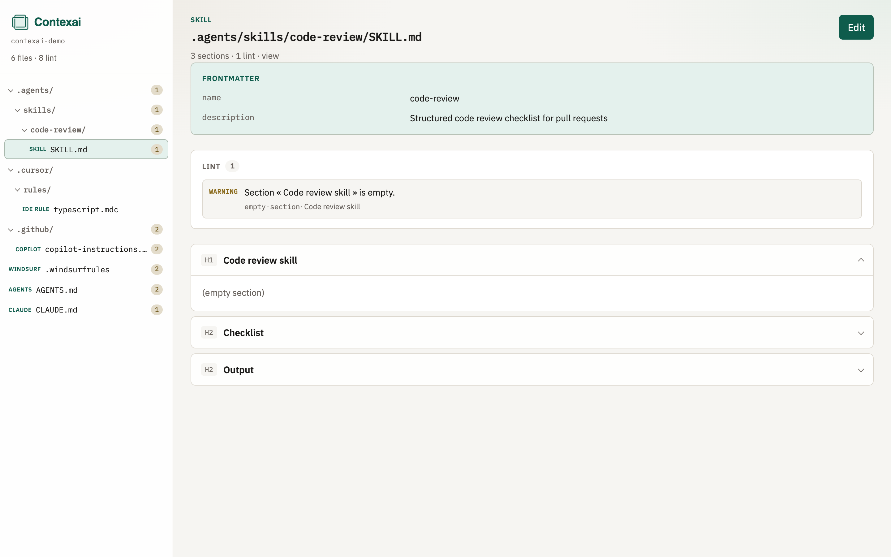

<p align="center">
  
</p>

<h1 align="center">Contexai</h1>

<p align="center">
  <a href="https://www.npmjs.com/package/contexai"></a>
  <a href="https://www.npmjs.com/package/contexai"></a>
  <a href="https://github.com/gonmedtara/Contexai/blob/main/LICENSE"></a>
</p>

<p align="center">Browse, lint, and edit AI context files in a repository via a local web UI.</p>

<p align="center">
  
</p>

```bash
npm install --save-dev contexai
npx contexai
```

Optional path:

```bash
npx contexai /path/to/repo
```

## What it does

- Discovers AI context files (`AGENTS.md`, `CLAUDE.md`, Copilot instructions / agents / prompts, IDE rules, `.windsurfrules`, `SKILL.md`, …)
- Shows them in a file tree
- Lints with externalized criteria (`criteria/lint.yaml`, overridable via `.contexai/lint.yaml`)
- Edit mode with reusable tags (frontmatter, MUST/SHOULD, XML blocks) + diff + save

## Roadmap

Next steps (not shipped yet):

- **AI-assisted lint** — optional model-backed review of context files (clarity, contradictions, prompt quality) alongside the current rule-based lint
- **Share context across projects** — reuse the same agents, prompts, instructions, and skills across multiple repositories without copy-paste drift

Details: [docs-site/guide/roadmap.md](./docs-site/guide/roadmap.md) · live docs after deploy: [Roadmap](https://gonmedtara.github.io/Contexai/guide/roadmap)

## Documentation

**Live docs:** [https://gonmedtara.github.io/Contexai/](https://gonmedtara.github.io/Contexai/)

**Source:** [github.com/gonmedtara/Contexai](https://github.com/gonmedtara/Contexai) · **npm:** [npmjs.com/package/contexai](https://www.npmjs.com/package/contexai)

Local preview: `npm run docs:dev` (sources in `docs-site/`).

Also in this repo:

- [Publishing to npm](./docs/publishing.md)
- [Configuration reference](./docs/configuration.md)

## Develop

```bash
npm install
npm run dev:sample
npm run build
npm start -- ./fixtures/sample-repo
```

Brand assets: [`brand/icon.png`](./brand/icon.png) · colors in [`brand/tokens.css`](./brand/tokens.css).

## Stack

Nuxt 4 · TypeScript · Nitro · VitePress (docs)
